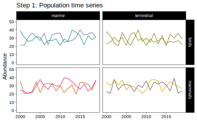
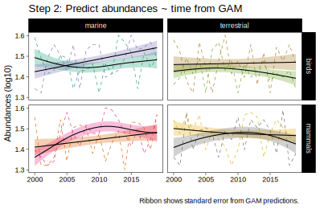
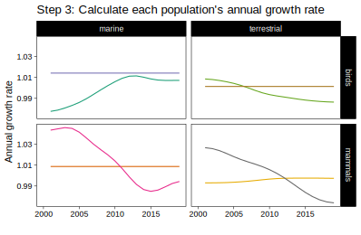
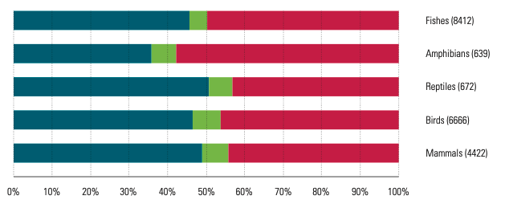

```{r setup, echo = F}
knitr::opts_chunk$set(
  comment = "#",
  #cache = TRUE,
  collapse = TRUE,
  warning = FALSE,
  message = FALSE,
  fig.width = 7,
  fig.height = 5.25,
  fig.align = 'center',
  fig.retina = 3
)

# base plot layout
mypar = list(mar = c(3,3,0.5,0.5), mgp = c(1.5, 0.3, 0), tck = -.008)

# xaringan Extra
xaringanExtra::use_xaringan_extra(c("tile_view", "animate_css", "tachyons"))
xaringanExtra::use_extra_styles(
  hover_code_line = TRUE,         #<<
  mute_unhighlighted_code = TRUE  #<<
)
xaringanExtra::use_editable(expires = 1)
xaringanExtra::use_panelset()
```
class: middle, title-slide

<div class="my-logo-left"></div>

# Living Planet Index (Test deployment)
<hr width="65%" align="left" size="0.3" color="orange"></hr>

### Katherine Hébert & Vincent Bellavance

<br><br><br><br><br>
<i class="fa fa-twitter fa-lg" style="color:#e7e8e2"></i> [@hebert_kat](https://twitter.com/hebert_kat)

<i class="fa fa-twitter fa-lg" style="color:#e7e8e2"></i> [@v_bellavance](https://twitter.com/v_bellavance)
---

# Introduction à l'Indice Planète Vivante

- Qu'est-ce que c'est?

- Qui l'utilise, et pour quoi?

- Ça fonctionne comment?

- Critiques

---
class: middle, center, inverse

# L'Indice Planète Vivante
## Qu'est-ce que c'est?
<hr width="100%" align="left" size="0.3" color="orange"></hr>

---
# Qu'est-ce que c'est?

* Indice global de changement de biodiversité
<br>
<br>
--

* Moyenne aggregée des changements dans l'abondance des populations vertébrés depuis 1970 
<br>
<br>
--

* Inclut **~21,000 populations** de **~4800** espèces de mammifères, oiseaux, poissons, reptiles, et amphibiens

.center[]

.cite[WWF. [2020](https://f.hubspotusercontent20.net/hubfs/4783129/LPR/PDFs/ENGLISH-SUMMARY.pdf) Living Planet Report 2020.]

---
# Tendance globale en 2020

L'indice global montre une **baisse moyenne de 68%** (95% CI: -73% à -62%) dans l'abondance des populations vertébrés suivis entre 1970 et 2016.

.center[]

.cite[WWF. [2020](https://f.hubspotusercontent20.net/hubfs/4783129/LPR/PDFs/ENGLISH-SUMMARY.pdf) Living Planet Report 2020.]

---
# Tendances régionales en 2020

L'indice peut aussi être décomposé par système (marin, eau douce, terrestre), groupe taxonomique, [région](http://stats.livingplanetindex.org/), etc.:


.cite[WWF. [2020](https://f.hubspotusercontent20.net/hubfs/4783129/LPR/PDFs/ENGLISH-SUMMARY.pdf) Living Planet Report 2020.]

---
class: middle, center, inverse

# L'Indice Planète Vivante
## Qui l'utilise, et pour quoi?
<hr width="100%" align="left" size="0.3" color="orange"></hr>

---
# Qui l'utilise, et pour quoi?

L'Indice Planète Vivante est un important **outil de communication** pour les gestionnaires de biodiversité et le public.

* Indicateur de biodiversité à l'échelle globale par la Convention sur la diversité biologique 

--

*  Évalue le progrès global vers des objectifs de conservation

--

  * 2010: Montre que les objectifs de la Convention n'ont pas été atteints 
--

  * 2020: Sera utilisé pour évaluer le progrès de 193 nations de la Convention vers les objectifs de biodiversité Aichi 
  
--
  
* Guide les politiques de conservation et la gestion de la biodiversité

---
# Qui l'utilise, et pour quoi?

L'indice est aussi utilisé par les médias pour communiquer le statut de la biodiversité au grand public.


Souvent communiqué de façon alarmiste, malgré les efforts des auteurs du rapport pour améliorer l'interprétation de l'indice...

---

class: middle, center, inverse

# L'Indice Planète Vivante
## Ça fonctionne comment?
<hr width="100%" align="left" size="0.3" color="orange"></hr>

---
.center[

]

---
.center[

]

---
.center[

]

---
.center[

]
---
.center[

]
---
.center[

]
---
.center[

]
---
# Calcul de l'indice


.center[

$$LPI(t) = LPI(t-1) * 10^{\overline{dt}}$$
]

---
.center[

]
---
class: middle, center, inverse

# L'Indice Planète Vivante
## Critiques
<hr width="100%" align="left" size="0.3" color="orange"></hr>

---
# Communication vs. complexité

* Une tendance moyenne est **facilement communiquée**


.cite[WWF. [2020](https://f.hubspotusercontent20.net/hubfs/4783129/LPR/PDFs/ENGLISH-SUMMARY.pdf) Living Planet Report 2020.]

---
# Communication vs. complexité

* Mais, la variabilité des tendances des populations est masquée

.font10[
Proportion de populations en croissance (bleu), stables (vert), et en déclin (rouge)
]

.pull-left2[

]

.pull-right2[

]

.cite[WWF. [2020](https://f.hubspotusercontent20.net/hubfs/4783129/LPR/PDFs/ENGLISH%20-%20TECH%20SUPPLIMENT.pdf) Living Planet Report 2020 (Technical Supplement).]

---
